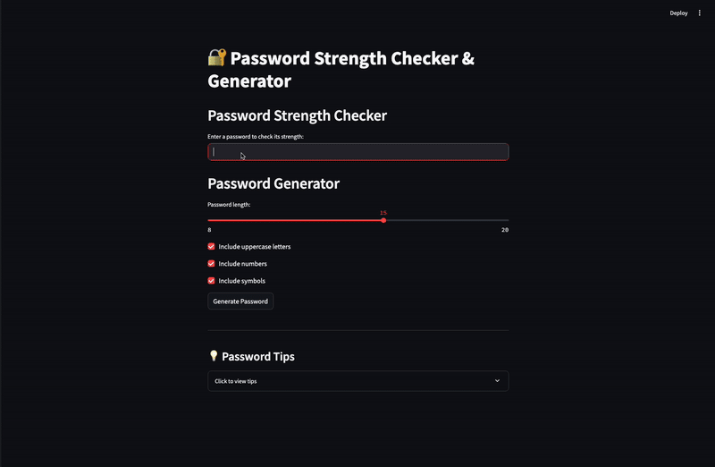

# 🔐 Password Agent with LangChain + Streamlit

A smart password assistant powered by LangChain and OpenAI. This project provides two key tools:

✅ Password Strength Checker – evaluates how secure a password is.

🔐 Password Generator – creates strong passwords with customizable options.

You can interact with the agent via:

🧠 Jupyter Notebook (LangChain agent logic)

🌐 Streamlit App (User-friendly UI)


# 🚀 Features

Check how strong your password is.

Generate secure passwords with control over length, symbols, numbers, and uppercase letters.

Natural language interface powered by LangChain and OpenAI.


## 🎥 Demo

Here’s a quick look at the app in action:




# 🧰 Tech Stack
LangChain

OpenAI API

Streamlit

Python 3.10+


# 📦 Requirements
Install the required packages:

pip install streamlit langchain openai python-dotenv

Make sure to set your OpenAI API key in the .env file!


# 🧪 Example Usage
agent.run("Is 'password123' secure?")
## Output: Weak password.

agent.run("Generate a strong password for my banking website.")
## Output: e.g. "K8#sP2l!9qTz"

agent.run("I need a 16-character password without symbols.")
## Output: e.g. "fR8zH2kL9mQwTuXe"

agent.run("Is 'Tr0ub4dor&3' a good password?")
## Output: Strong password 💪


# 📁 File Structure
```bash
agent-prompt-engineering/
├── app.py                  # Streamlit app interface
├── password_agent.ipynb    # Main notebook with LangChain agent and tools
├── .env                    # Environment file (should not be pushed)
├── .gitignore              # Ignores .env and other unnecessary files
└── README.md               # Project documentation
```


# 📝 How to Run
1. Clone the repository:
```bash
git clone https://github.com/raneemalshehri/agent-prompt-engineering.git
cd agent-prompt-engineering
```
2. Install the required packages:
```bash
pip install langchain openai
```
3. Set your OpenAI API key:

Create a .env file in the root directory and add:
```bash
OPENAI_API_KEY=your-api-key
```
4. Run the agent:
```bash
streamlit run app.py
```

# Credits
 ❤ Made by Raneem Alshehri

